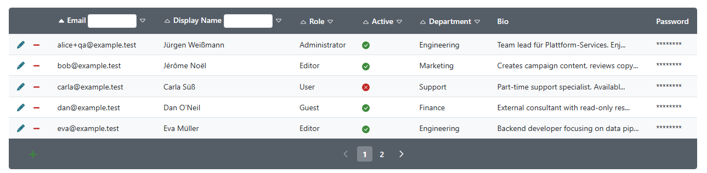

# phpMySQLGrid

A flexible MySQL data grid library for PHP.

phpMySQLGrid provides a reusable class to display and manage MySQL table data in a grid with filtering, sorting, pagination, and CRUD actions.



## Features

- Table rendering with customizable columns
- CRUD modes: view, add, edit, delete
- Field types: text, boolean, lookup, password, selection, multiline text, file
- Sorting, filtering, and pagination
- Hook callbacks for add, edit, and delete workflows
- CSS-based styling with included themes

## Requirements

- PHP 8.2 or newer
- MySQL-compatible database

## Installation

Install with Composer:

    composer require tschueller/phpmysqlgrid

For development in this repository:

    composer install

## Simple Example

```php
<?php
require_once __DIR__ . '/vendor/autoload.php';

session_start();

$grid = new MySQLGrid();
$grid->hostname = '127.0.0.1';
$grid->username = 'root';
$grid->password = '';
$grid->database = 'test_db';
$grid->table = 'users';
$grid->primary = 'id';
$grid->name = 'users_grid';
$grid->limit = 10;

$grid->columns = array(
    array('field' => 'id', 'caption' => 'ID', 'can_sort' => true, 'can_filter' => false),
    array('field' => 'username', 'caption' => 'Username'),
    array('field' => 'email', 'caption' => 'Email'),
    array('field' => 'active', 'caption' => 'Active', 'type' => PHPMYSQLGRID_BOOLEAN),
);

$grid->execute();
```

## Database Connection Modes

phpMySQLGrid supports two connection modes:

1. Default mode (legacy-compatible): internal PDO connection created automatically from `hostname`, `port`, `username`, `password`, `database` properties.
2. Injected connection mode: externally managed PDO connection via `setDatabaseConnection()`.

### 1) Default mode (internal PDO)

Set the connection properties and call `execute()`. The class creates a `PDO` connection internally using `mysql:host=…;port=…;dbname=…;charset=utf8mb4`. This mode is fully backward compatible with existing integrations that set these properties.

```php
$grid = new MySQLGrid();
$grid->hostname = "127.0.0.1";
$grid->username = "root";
$grid->password = "";
$grid->database = "test_db";
$grid->table = "users";
$grid->primary = "id";
$grid->execute();
```

### 2) Injected PDO mode

Use this mode when you already manage your DB connection externally or when you want to run integration tests against SQLite.

```php
$pdo = new PDO("mysql:host=127.0.0.1;dbname=test_db;charset=utf8mb4", "root", "");
$pdo->setAttribute(PDO::ATTR_ERRMODE, PDO::ERRMODE_EXCEPTION);

$grid = new MySQLGrid();
$grid->setDatabaseConnection($pdo, "pdo_mysql");
$grid->table = "users";
$grid->primary = "id";
$grid->execute();
```

### SQLite example (tests/local tooling)

```php
$pdo = new PDO("sqlite::memory:");
$pdo->setAttribute(PDO::ATTR_ERRMODE, PDO::ERRMODE_EXCEPTION);

$grid = new MySQLGrid();
$grid->setDatabaseConnection($pdo, "pdo_sqlite");
```

## Manual Demo Page (SQLite)

This repository includes a manual demo page with seeded user data and a persistent SQLite database file.

The demo covers these field types:

- text
- boolean
- selection
- lookup
- multiline text
- password

Start the demo server from the project root:

    composer run demo:start

Then open:

    http://127.0.0.1:8000/

Notes:

- The demo database is stored at `demo/demo.sqlite` and is kept across page loads.
- Use `http://127.0.0.1:8000/demo/index.php?reset=1` to recreate schema and seed data.
- Add/edit/delete/filter/sort can be tested directly in the browser.

Notes:

- In injected mode, the provided PDO connection is reused for all database operations.
- In injected mode, the caller owns the connection lifecycle.
- All database operations use PDO exclusively; mysqli is no longer supported.

## Asset Publishing for Host Projects

By default, package assets are not automatically copied into your web root.
Publish them from your host project with:

    php vendor/bin/phpmysqlgrid-assets

Default target is:

    assets/phpmysqlgrid

Override target path with either an argument or an environment variable:

    php vendor/bin/phpmysqlgrid-assets --target public/assets/phpmysqlgrid

Bash:

    PHPMYSQLGRID_ASSET_TARGET=public/assets/phpmysqlgrid php vendor/bin/phpmysqlgrid-assets

PowerShell:

    $env:PHPMYSQLGRID_ASSET_TARGET="public/assets/phpmysqlgrid"; php vendor/bin/phpmysqlgrid-assets

### Automatic Publishing in a Host Project

In your host project's `composer.json`, you can run asset publishing automatically after install/update:

```json
{
    "scripts": {
        "post-install-cmd": [
            "php vendor/bin/phpmysqlgrid-assets --target public/assets/phpmysqlgrid"
        ],
        "post-update-cmd": [
            "php vendor/bin/phpmysqlgrid-assets --target public/assets/phpmysqlgrid"
        ]
    }
}
```

You can also route through environment variables:

```json
{
    "scripts": {
        "post-install-cmd": [
            "@grid-assets:publish"
        ],
        "post-update-cmd": [
            "@grid-assets:publish"
        ],
        "grid-assets:publish": [
            "php vendor/bin/phpmysqlgrid-assets"
        ]
    }
}
```

With that variant, set the target path per shell before running Composer:

Bash:

        export PHPMYSQLGRID_ASSET_TARGET=public/assets/phpmysqlgrid

PowerShell:

        $env:PHPMYSQLGRID_ASSET_TARGET="public/assets/phpmysqlgrid"

## Include CSS with Cache Busting

Use the static helper to generate a stylesheet URL with cache busting.
Published assets store their hash once in a manifest during `assets:publish`.
The helper reads that manifest first, falls back to a direct content hash when no manifest is available, and finally falls back to package version.

```php
echo MySQLGridAssets::cssTag('/assets/phpmysqlgrid');
// or:
$href = MySQLGridAssets::cssUrl('/assets/phpmysqlgrid');
echo '<link rel="stylesheet" href="' . htmlspecialchars($href, ENT_QUOTES, 'UTF-8') . '">';
```

JavaScript assets are supported as well when you add files under `assets/js`:

```php
echo MySQLGridAssets::jsTag('/assets/phpmysqlgrid');
// or:
$src = MySQLGridAssets::jsUrl('/assets/phpmysqlgrid', 'mysqlgrid.js');
echo '<script src="' . htmlspecialchars($src, ENT_QUOTES, 'UTF-8') . '" defer="defer"></script>';
```

Manual include (without helper):

```html
<link rel="stylesheet" href="/assets/phpmysqlgrid/mysqlgrid.css">
```

## Project Files

- src/MySQLGrid.php: Main library class
- src/MySQLGridAssets.php: Asset URL/tag helper with cache busting
- src/MySQLGridAssetPublisher.php: Asset publish implementation
- assets/css/mysqlgrid.css: Default grid style
- assets/js/: Optional JavaScript assets published alongside CSS
- bin/phpmysqlgrid-assets: CLI command for publishing assets
- phpstan.neon.dist: Static analysis configuration
- TODO.md: Planned follow-up tasks and features
- CHANGELOG.md: Release history
- .github/copilot-instructions.md: Workspace development guidelines
- .github/instructions/php-core.instructions.md: PHP coding and API stability rules
- .github/instructions/testing.instructions.md: Test architecture and conventions
- .github/instructions/styling.instructions.md: CSS theming and styling guidelines
- .github/instructions/accessibility.instructions.md: Accessibility, ARIA, and keyboard navigation requirements
- docs/refactoring-notes-v0.6.md: Internal detailed refactoring notes (v0.6 vs v0.5.11)

## Quality Checks

Run all checks:

    composer run lint

Run checks individually:

    composer run lint:syntax
    composer run lint:style
    composer run lint:static

Run unit tests:

    composer run test

## Current Static Analysis Level

The project currently uses PHPStan level 8.

## Contributing

1. Keep changes backward compatible when possible.
2. Follow the existing coding style in the repository.
3. Run lint checks before submitting changes.
4. Update CHANGELOG.md for user-visible fixes and improvements.

For contribution details, see CONTRIBUTING.md.

## Additional Documentation

- Changelog and release history: CHANGELOG.md
- Workspace development guidelines: .github/copilot-instructions.md
- Development specializations:
  - PHP core rules and API stability: .github/instructions/php-core.instructions.md
  - Testing conventions and integration patterns: .github/instructions/testing.instructions.md
  - Styling, CSS naming, and theming: .github/instructions/styling.instructions.md
  - Accessibility, ARIA, and keyboard support: .github/instructions/accessibility.instructions.md
- Internal detailed refactoring notes (v0.6 vs v0.5.11): docs/refactoring-notes-v0.6.md

## Security

Please report vulnerabilities according to SECURITY.md.

## Code of Conduct (Optional)

For now, this project does not enforce a dedicated code of conduct file due to its small scope.
If the contributor base grows, CODE_OF_CONDUCT.md can be added again.

## License

MIT
